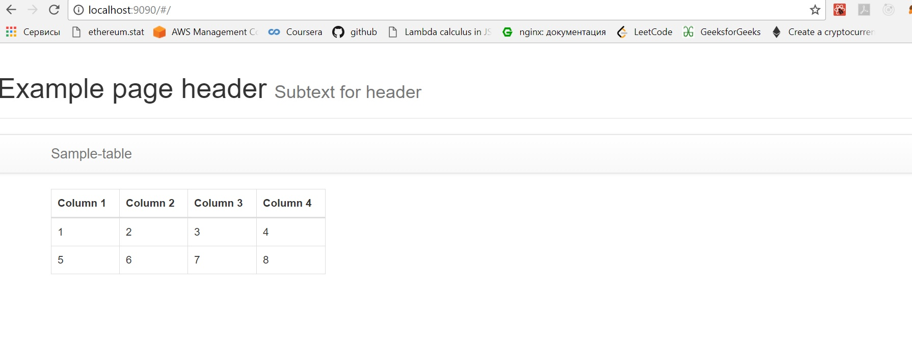

## Тестировалось на NodeJs 6.9.1 и Chrome 64.0.3282.186

### После установки nodejs обновить пакетный менеджер npm
в консоли
```sh
npm i -g npm
```

### Зависимости для express
в консоли из папки проекта
```sh
cd server
npm i
```

### Зависимости проекта
в консоли из папки проекта
```sh
npm i
```

### Сборка проекта
в консоли из папки проекта
```sh
npm run build
```

### Запуск проекта
в консоли из папки проекта (запуск express)
```sh
npm run server
```
в другой консоли из папки проекта (запуск webpack-dev-server)
```sh
npm start
```

Адрес :
```
http://localhost:9090
```

Well done:

